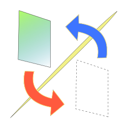

# Parallel Envs

Using Parallel Envs, you can put a library into the system folder without worry about making the folder dirty.  

After installing this, you can create an "env" and add your files to the "env". Then, you get a right to make your "env" disabled or undo it. If an "env" were made disabled, the files which is included in it would be disabled(deleted). If undo, the files would reappear!

## Contains

This project consists of three items.

- Parallel Envs System (Library)
- Parallel Envs CUI tool (Executable item)
- Parallel Envs GUI tool (Executable item, Windows only)

## Contribution

1. Fork it
2. Create your feature branch (git checkout -b feature/some)
3. Commit your changes (git commit -am 'Add some feature')
4. Push to the branch (git push origin feature/some)
5. Create new Pull Request

## Author

[capra314cabra](https://github.com/capra314cabra)
